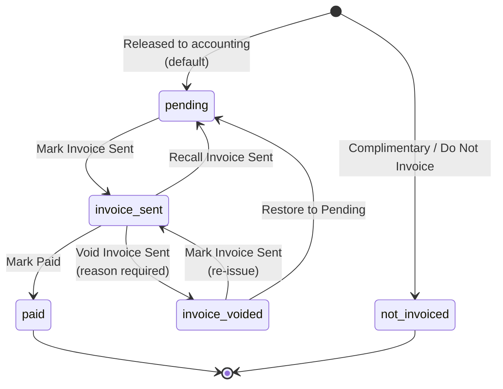
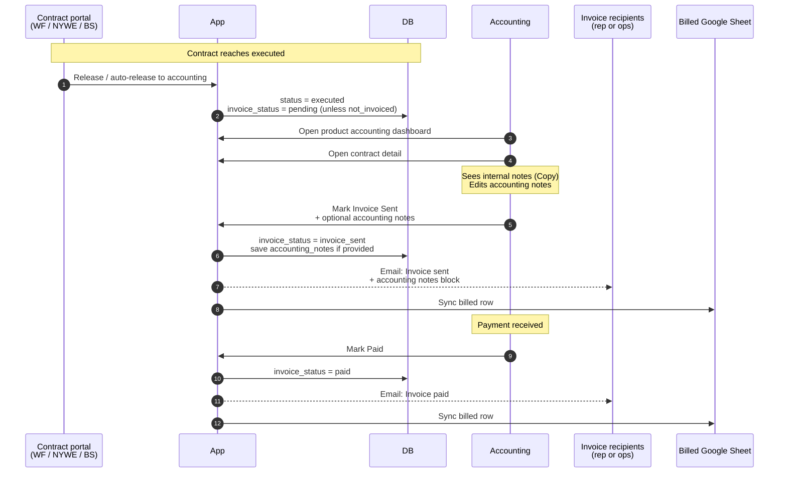
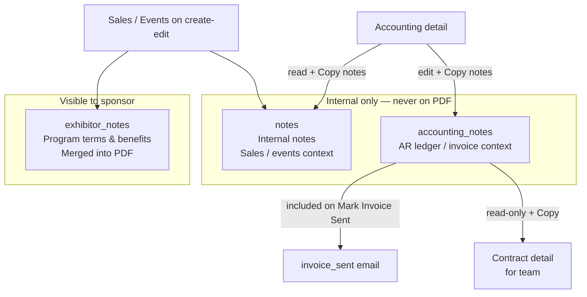
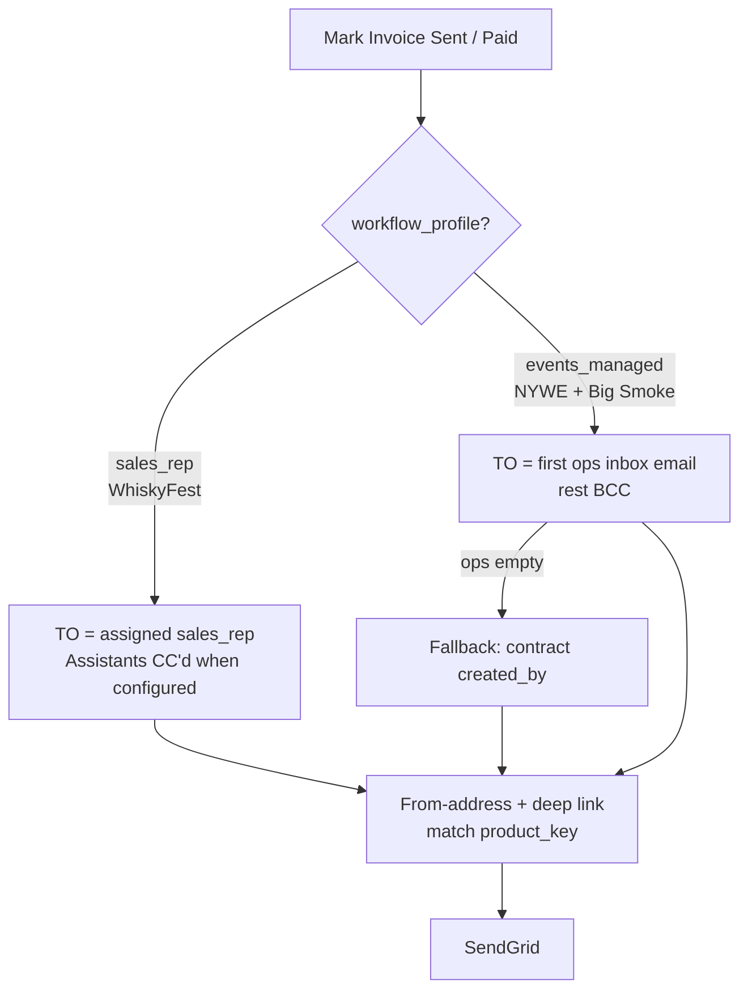

# Accounting & Notes — All Event Platforms

How executed contracts move through A/R for **WhiskyFest**, **NYWE**, and **Big Smoke**, including invoice status, notes visibility, Mark Invoice Sent, and email routing.

Platform hosts and product keys: [PORTALS.md](./PORTALS.md). Contract signing lifecycle: [WORKFLOW.md](./WORKFLOW.md).

---

## 1. Where accounting lives

| Product | Dashboard | Detail |
|---------|-----------|--------|
| WhiskyFest | `/accounting` | `/accounting/[id]` |
| NYWE | `/accounting/nywe` (or `/accounting` on NYWE host) | same pattern `/[id]` |
| Big Smoke | `/accounting/big-smoke` (or `/accounting` on Big Smoke host) | same |

Only contracts with `status = executed` appear. Lists are filtered by `events.product_key`. Actors: users with `is_accounting` or `role = admin`.

**UI:** shared AR list (`lib/accounting-dashboard-view.tsx`) + detail (`app/(dashboard)/accounting/[id]/page.tsx`) + actions (`components/accounting/accounting-detail-actions.tsx`).  
**API:** `PATCH /api/accounting/contracts/[id]`.

---

## 2. Invoice status state machine

Prerequisite: contract is **executed**. Complimentary / do-not-invoice deals use `invoice_status = not_invoiced` (typically via `no_charge_booth` at create) and cannot be marked sent.



| Status | UI label | Meaning |
|--------|----------|---------|
| `pending` | Pending | Ready to invoice |
| `invoice_sent` | Invoice Sent | AR recorded send; awaiting payment |
| `paid` | Paid | Payment recorded |
| `not_invoiced` | Do Not Invoice | Complimentary; track only — cannot Mark Sent |
| `invoice_voided` | Invoice Voided | Sent invoice cancelled; removed from billed export |

### Actions

| Action | From | To | Side effects |
|--------|------|-----|--------------|
| **Mark Invoice Sent** | `pending` or `invoice_voided` | `invoice_sent` | Sets `invoice_sent_at` / `invoice_sent_by`; optional save of `accounting_notes`; email to rep/ops; billed sheet sync; audit `invoice_marked_sent` |
| **Mark Paid** | `invoice_sent` | `paid` | Sets `paid_at` / `paid_by`; paid email; sheet sync; audit |
| **Recall Invoice Sent** | `invoice_sent` | `pending` | Clears sent fields; **no** sales email; sheet refresh |
| **Void Invoice Sent** | `invoice_sent` | `invoice_voided` | Reason ≥ 5 chars; clears sent fields; sheet refresh |
| **Restore to Pending** | `invoice_voided` | `pending` | Ready to invoice again (does not mark sent) |
| **Save notes** | any | — | Updates `accounting_notes` only |

---

## 3. Happy path (all platforms)



---

## 4. Three notes fields



| Field | Who writes | Who reads | Copy |
|-------|------------|-----------|------|
| `exhibitor_notes` | Sales / events | Sponsor (PDF) + team | — |
| `notes` | Sales / events | Team + **AR on accounting detail** | **Copy notes** on AR detail |
| `accounting_notes` | Accounting (Save notes or Mark Invoice Sent dialog) | AR; anyone who can open the contract (invoice-sent recipients) | **Copy notes** on AR + contract detail |

Labels/hints: `lib/contract-notes-copy.ts`. Copy UI: `components/ui/copyable-notes.tsx`.

### Mark Invoice Sent dialog

1. AR clicks **Mark Invoice Sent** (from `pending` or `invoice_voided`).
2. Dialog opens with current `accounting_notes` prefilled.
3. Optional notes → submit `{ mark_invoice_sent: true, accounting_notes }`.
4. Notes are stored, included in the invoice-sent email, and shown on the contract page.

Standalone **Save notes** still works without changing invoice status.

---

## 5. Invoice-sent / paid email routing



| Product | Recipients for `invoice_sent` / `invoice_paid` |
|---------|-----------------------------------------------|
| **WhiskyFest** | Assigned sales rep (`sales_reps.email`). Rep assistants CC via `rep_assistants` when the notifier passes `assistantRepId`. |
| **NYWE** | Ops inbox: `NYWE_OPS_NOTIFICATION_EMAILS`, else `EVENTS_MANAGED_INVOICE_NOTIFICATION_EMAILS`. Fallback: `created_by`. |
| **Big Smoke** | Same ops inbox env vars as NYWE (events-managed path). Fallback: `created_by`. |

Countersigners and `NOTIFICATION_EXCLUDED_EMAILS` are stripped from invoice recipients.

**Email body includes:** company, amount, timestamp, optional **Accounting notes**, link into the correct portal.

**Code:** `lib/notification-routing.ts` (`invoice_sent` / `invoice_paid`), `lib/notifications.ts` (`notifySalesRepInvoiceSent`, `notifySalesRepInvoicePaid`).

---

## 6. Per-platform AR checklist

```mermaid
flowchart LR
  subgraph WF["WhiskyFest"]
    W1[/accounting] --> W2[Filter whiskyfest events]
    W2 --> W3[Mark sent → email rep]
  end

  subgraph NY["NYWE"]
    N1[/accounting/nywe] --> N2[Filter wine_spectator]
    N2 --> N3[Mark sent → email ops inbox]
  end

  subgraph BS["Big Smoke"]
    B1[/accounting/big-smoke] --> B2[Filter big_smoke]
    B2 --> B3[Mark sent → email ops inbox]
  end
```

Behavior that is **the same** on all three:

- Invoice state machine (pending → sent → paid; recall / void / restore)
- Internal notes visible on AR detail with copy
- Accounting notes + Mark Invoice Sent dialog
- Contract detail shows accounting notes to internal viewers
- Billed Google Sheets export / sync
- CSV / Excel download from AR list

Behavior that **differs**:

- Product branding, export titles, from-address, contract URLs
- Who gets invoice-sent / paid mail (rep vs ops)
- How the deal reached `executed` (manual release vs NYWE auto-release after countersign)

---

## 7. Billed export

When AR marks invoice sent, paid, recalled, or voided, the app syncs the billed Google Sheet for that product’s accounting export.

- Manual: **Export billed to Google Sheets** on each dashboard
- Auto: after invoice status mutations

See [INTEGRATIONS.md](./INTEGRATIONS.md) (Google Sheets).

---

## 8. API summary

`PATCH /api/accounting/contracts/[id]` — accounting or admin.

Send **one** status action (except notes may ride with Mark Invoice Sent):

| Body | Effect |
|------|--------|
| `{ mark_invoice_sent: true, accounting_notes?: string }` | Mark sent; optional notes save + email |
| `{ mark_paid: true }` | Mark paid |
| `{ recall_invoice_sent: true }` | Back to pending |
| `{ void_invoice_sent: true, void_reason: string }` | Void sent invoice |
| `{ restore_voided_invoice: true }` | Voided → pending |
| `{ accounting_notes: string }` | Save notes only |

Full reference: [API.md](./API.md).

---

## 9. Audit actions

| Action | When |
|--------|------|
| `invoice_marked_sent` | Mark Invoice Sent |
| `invoice_marked_paid` | Mark Paid |
| `invoice_sent_recalled` | Recall |
| `invoice_sent_voided` | Void (reason in metadata) |
| `invoice_voided_restored` | Restore to pending |

---

*Last updated: July 2026.*  
*Contact: Michael Capace — mcapace@mshanken.com*
