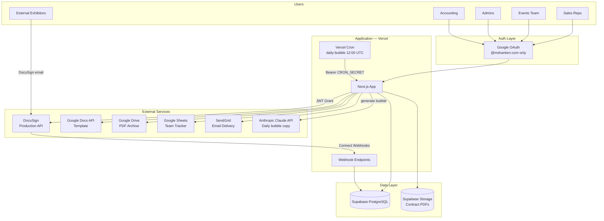

# Architecture

## System overview

## Component responsibilities

- **Next.js App**: UI rendering, API routes, business orchestration, role gating, impersonation behavior, and dashboard/accounting workflows.
- **Supabase**: source of truth for contracts, users, events, sales reps, rep assistant mappings, and audit trail data.
- **Supabase Storage**: private PDF object store for draft/signed contract files (`contract-pdfs` bucket) with RLS-aware signed URL access.
- **DocuSign**: envelope lifecycle, signer workflows, and webhook source for status transitions.
- **Google Docs**: master contract template merge + rendering path to PDF.
- **Google Drive**: backup/archive location for generated files and operational recovery.
- **Google Sheets**: business-facing tracker synchronized from signing/release/cancel/void events.
- **SendGrid**: transactional notification channel (release, cancellation, void, accounting workflows).
- **Vercel Cron**: scheduled `GET /api/cron/daily-bubble` (see `vercel.json`) creates today’s Eastern `daily_bubbles` row when missing, via Claude + DB + optional email.
- **Anthropic Claude**: generates short fact/joke/quote text for the dashboard daily bubble (`lib/bubble-generator.ts`).

## High-level flow

Sales rep creates contract → events team approves → app sends DocuSign envelope → exhibitor completes signing (including exhibitor-only text tabs for mailing, phone, billing, optional event contact) → countersigner signs → **admin** releases to accounting → AR tracks invoice sent/paid.

## External dependencies and failure impact

### Supabase

Primary persistence and authorization metadata backend. If unavailable, app reads/writes fail and core workflows stop.

### Supabase Storage

Holds canonical contract PDFs. If unavailable, embedded/downloaded PDFs fail (legacy Google links may still work for older contracts).

### DocuSign

Handles legal signatures and status events. If unavailable, sending/voiding/resending contracts and webhook-driven transitions stop.

### Google Docs API

Used to render contracts from template tokens. If unavailable, draft PDF generation fails.

### Google Drive API

Backup archive + temp docs lifecycle. If unavailable, backup writes and cleanup operations fail; primary storage remains Supabase.

### Google Sheets API

Tracker sync for operational teams. If unavailable, sheet rows lag but core contract flow can continue.

### SendGrid

Notification transport. If unavailable, workflow still runs but internal/external notification delivery is delayed or lost.

### Vercel

Runtime host for UI + API routes. Outage fully blocks app availability.

## Why this architecture

- **Next.js + App Router** gives a unified frontend/backend codebase with server rendering and route handlers.
- **Supabase** offers managed Postgres, SQL-first migrations, and RLS-compatible storage access patterns.
- **DocuSign** is the enterprise-standard signing platform already aligned with legal/compliance expectations.
- **Google Workspace integrations** align with existing operational tooling (templates, drives, sheets).
- **Vercel** provides low-friction deployment and environment management for a small, fast-moving team.
