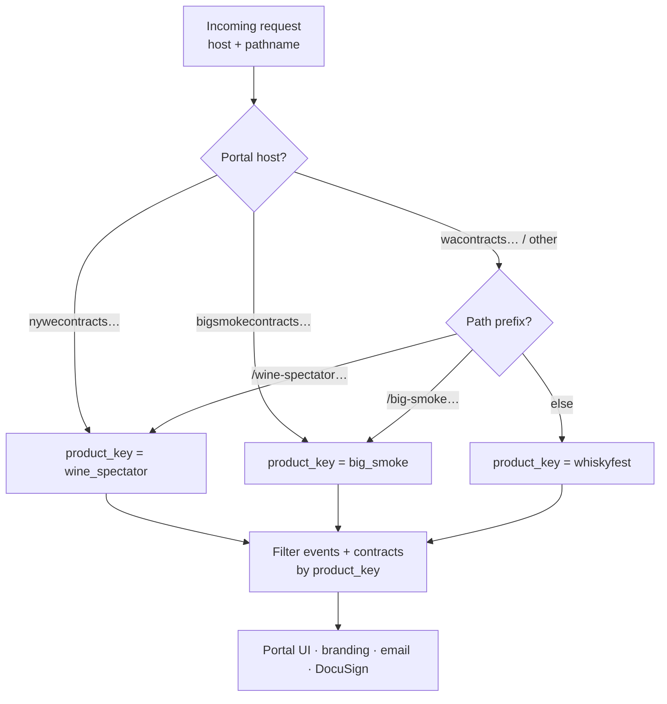
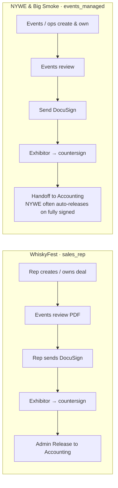
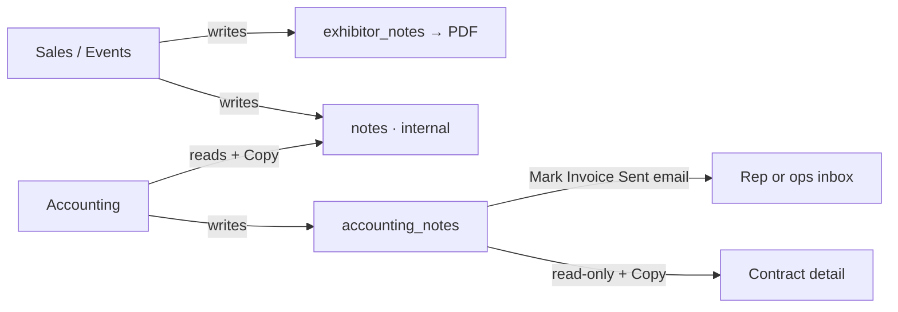
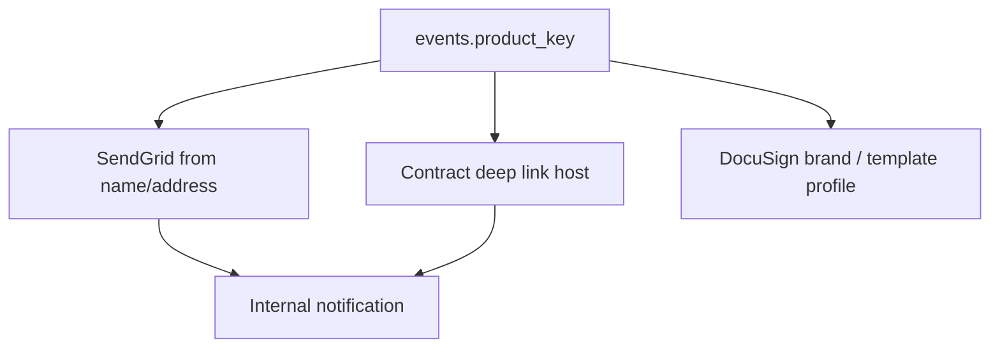

# Event Platforms — WhiskyFest · NYWE · Big Smoke

One Next.js app serves three branded contract portals. Each portal is scoped by `events.product_key`, has its own host / path prefix, DocuSign branding, SendGrid identity, and accounting dashboard.

Related: [Workflow](./WORKFLOW.md) (contract lifecycle), [Accounting](./ACCOUNTING.md) (AR + notes), [Integrations](./INTEGRATIONS.md), [Permissions](./PERMISSIONS.md).

---

## 1. Product matrix

| | **WhiskyFest** | **NYWE** (Wine Spectator) | **Big Smoke** |
|---|---|---|---|
| `product_key` | `whiskyfest` | `wine_spectator` | `big_smoke` |
| Default host | `wacontracts.whiskyadvocate.com` | `nywecontracts.winespectator.com` | `bigsmokecontracts.cigaraficionado.com` |
| Path prefix (shared host / local) | `/` | `/wine-spectator` | `/big-smoke` |
| Accounting URL | `/accounting` | `/accounting/nywe` (or `/accounting` on NYWE host) | `/accounting/big-smoke` (or `/accounting` on Big Smoke host) |
| Typical `workflow_profile` | `sales_rep` | `events_managed` | `events_managed` |
| Contract template profile | `whiskyfest` | `nywe_vendor` | `big_smoke` |
| Default from-address | `wfcontracts@whiskyadvocate.com` | `nywecontracts@winespectator.com` | `bigsmokecontracts@cigaraficionado.com` |
| Primary operators | Sales reps + events | Events / ops | Events / ops |

Hosts are overridable via `WHISKYFEST_PORTAL_HOST`, `NYWE_PORTAL_HOST`, `BIG_SMOKE_PORTAL_HOST`.

**Code:** `lib/product-portal.ts`, `lib/portal-host.ts`, `lib/accounting-portal.ts`, `lib/product-email.ts`, `lib/contract-template-profile.ts`.

---

## 2. How a request picks a portal



On a dedicated product host, clean URLs map to internal prefixed paths (e.g. NYWE host `/contracts/…` → internal `/wine-spectator/contracts/…`). Accounting follows the same pattern: on the NYWE host, `/accounting` is NYWE AR; on the WhiskyFest host, NYWE AR is reached at `/accounting/nywe`.

---

## 3. Workflow profiles per platform



| Concern | WhiskyFest | NYWE | Big Smoke |
|---------|------------|------|-----------|
| Deal owner for most alerts | Assigned **sales_rep** | **created_by** (ops) | **created_by** (ops) |
| Partial-sign app email | Yes (countersign queue) | Skipped — DocuSign only | Yes (WF/BS countersign group) |
| Fully-signed app email | Yes | Skipped — auto-release path | Yes |
| Invoice-sent / paid email | Sales rep (+ assistants) | Ops inbox | Ops inbox (same env as NYWE) |

Details: [Accounting — notification routing](./ACCOUNTING.md#5-invoice-sent--paid-email-routing).

---

## 4. End-to-end platform map

```mermaid
flowchart TB
  subgraph Portals["Contract portals"]
    PWF[WhiskyFest Contracts]
    PNY[NYWE Contracts]
    PBS[Big Smoke Contracts]
  end

  subgraph Shared["Shared backend"]
    DB[(Supabase · contracts<br/>scoped by event.product_key)]
    DS[DocuSign]
    SG[SendGrid]
    GD[Google Docs / Drive]
    SH[Google Sheets · billed export]
  end

  subgraph AR["Accounting dashboards"]
    AWF[/accounting]
    ANY[/accounting/nywe]
    ABS[/accounting/big-smoke]
  end

  PWF --> DB
  PNY --> DB
  PBS --> DB
  PWF --> DS
  PNY --> DS
  PBS --> DS
  DB --> AR
  AWF --> SG
  ANY --> SG
  ABS --> SG
  AR --> SH
  Portals --> GD
```

AR sees **executed** contracts for that product only. Shared users (admin / `is_accounting`) can open all three dashboards; lists never mix product_keys.

---

## 5. Notes model (all platforms)

Same three fields on every product:

| Field | Label in UI | Who sees it | On PDF? | Copy button? |
|-------|-------------|-------------|---------|--------------|
| `exhibitor_notes` | Program terms & benefits | Sponsor + team | **Yes** | No |
| `notes` | Internal notes (team only) | Sales / events / admin; **AR on accounting detail** | No | **Yes** on AR detail |
| `accounting_notes` | Accounting notes | AR + invoice-sent email recipients on contract page | No | **Yes** on AR + contract detail |

Sponsor never sees `notes` or `accounting_notes`. Full AR/notes flows: [ACCOUNTING.md](./ACCOUNTING.md).



---

## 6. Branding & email identity



| Product | Default from email | Workspace label (approx.) |
|---------|-------------------|---------------------------|
| WhiskyFest | `wfcontracts@whiskyadvocate.com` | WhiskyFest Contracts |
| NYWE | `nywecontracts@winespectator.com` | NYWE Contracts |
| Big Smoke | `bigsmokecontracts@cigaraficionado.com` | Big Smoke Contracts |

Overrides: `WHISKYFEST_FROM_*`, `WINE_SPECTATOR_FROM_*` / `NYWE_FROM_*`, `BIG_SMOKE_FROM_*`.

---

## 7. Key modules

| Area | Files |
|------|--------|
| Product / paths | `lib/product-portal.ts`, `lib/portal-host.ts` |
| Accounting portal scope | `lib/accounting-portal.ts` |
| Workflow / templates | `lib/contract-template-profile.ts` |
| Email branding | `lib/product-email.ts` |
| Notification routing | `lib/notification-routing.ts` |
| Status digests | `lib/product-status-digest.ts`, cron `/api/cron/product-status-digest` |
| Copy / labels | `lib/nywe-copy.ts`, `lib/big-smoke-copy.ts`, `lib/contract-notes-copy.ts` |
| Seed / migrations | e.g. `072_big_smoke_portal.sql`, NYWE event seeds |

## 8. Status digests (Kate / Jake / Susannah)

Weekday emails at **9:00 AM, 1:00 PM, and 5:00 PM Eastern** summarize each portal’s pipeline for the product owner:

| Portal | Default recipient |
|--------|-------------------|
| WhiskyFest | Kate Brumley (`kbrumley@mshanken.com`) |
| Big Smoke (Cigar) | Jake Cohen (`jcohen@mshanken.com`) |
| NYWE (Wine) | Susannah Nolan (`snolan@mshanken.com`) |

Each digest includes status counts, AR invoice buckets for executed contracts, items needing attention (review / signing / countersign), and contracts updated in the last ~8 hours — plus portal + accounting links. From-address matches the product (WF / Big Smoke / NYWE).

Override recipients with `PRODUCT_DIGEST_WHISKYFEST_EMAILS`, `PRODUCT_DIGEST_BIG_SMOKE_EMAILS`, `PRODUCT_DIGEST_NYWE_EMAILS`. Optional CC: `PRODUCT_DIGEST_CC_EMAILS`. Cron: `/api/cron/product-status-digest`.

### Kate / Stephen email quiet mode (WhiskyFest)

Katherine and Stephen are filtered out of mid-funnel noise (approved, sent-back, voided, fully signed, invoice paid, etc.):

| Person | Default emails |
|--------|----------------|
| Kate Brumley | `contract_executed`, `invoice_sent` (all WhiskyFest deals) |
| Stephen Senatore | `contract_executed` only |

Overrides: `WHISKYFEST_KATE_NOTIFICATION_KINDS`, `WHISKYFEST_STEVE_NOTIFICATION_KINDS` (comma-separated kinds; empty Steve value = no workflow mail).

---

*Last updated: July 2026.*  
*Contact: Michael Capace — mcapace@mshanken.com*
