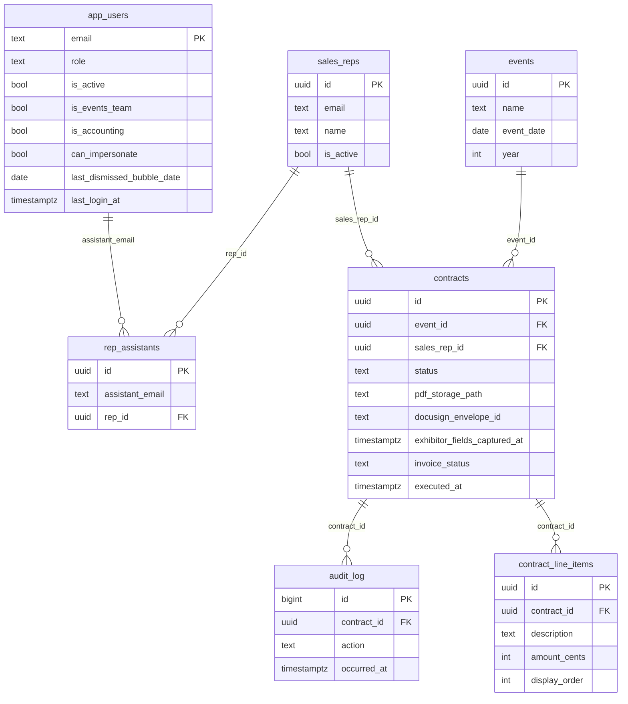

# Schema

## ER diagram

See table sections below for **`daily_bubbles`** and **`access_requests`** (no direct FK to `contracts` in the ER view above). `daily_bubbles` is keyed by US Eastern `content_date`; **`app_users.last_dismissed_bubble_date`** hides today’s banner for that user only.

## Tables

## `contracts`
- **Purpose**: central lifecycle record for each exhibitor contract
- **Key columns**: exhibitor display/legal name, signer, status, booth pricing, DocuSign metadata, billing block (often filled at signing), **`exhibitor_fields_captured_at`** (when exhibitor DocuSign text tabs wrote mailing/phone/billing/event contact), invoice / paid fields, PDF storage path, void/cancel data
- **Indexes**: status/event/date and FK access patterns
- **RLS**: app enforces role access; storage access additionally constrained via policy function
- **FKs**: `event_id -> events.id`, `sales_rep_id -> sales_reps.id`

## `contract_line_items`
- **Purpose**: optional per-contract line items (sponsorships, add-ons); summed into `contracts_with_totals.grand_total_cents`
- **FK**: `contract_id -> contracts.id` (cascade delete)

## `daily_bubbles`
- **Purpose**: dashboard “Did You Know” / joke / quote for a given Eastern `content_date`; generated by cron/admin (Claude) unless removed
- **Key columns**: `content_type`, `content`, `attribution`, `generated_at`, `removed_at` / `removed_by` (admin “remove for all”)

## `access_requests`
- **Purpose**: self-service access requests pending admin review

## `app_users`
- **Purpose**: access control + feature flags for authenticated users
- **Key columns**: `role`, `is_active`, `is_events_team`, `is_accounting`, `can_impersonate`, `theme_preference`, tour fields, **`last_login_at`**, **`last_dismissed_bubble_date`**
- **Indexes**: email PK
- **RLS**: table protected; service role and app-layer auth used for administrative changes

## `sales_reps`
- **Purpose**: canonical sales rep directory and ownership mapping
- **Key columns**: `id`, `email`, `name`, `is_active`, sort metadata

## `rep_assistants`
- **Purpose**: maps assistants to one or more reps they support
- **Key columns**: `assistant_email`, `rep_id`
- **Indexes**: assistant lookup + rep lookup

## `events`
- **Purpose**: event catalog for contract assignment and reporting
- **Key columns**: event identity, date, venue, active flag, Shanken countersigner defaults

## `audit_log`
- **Purpose**: immutable action/status history
- **Key columns**: actor, action, from/to status, metadata payload, timestamp
- **FK**: `contract_id -> contracts.id`

## Views

## `contracts_with_totals`
- Denormalized read model for dashboard/list pages with computed totals and joined sales rep metadata.

## Storage schema notes

- Bucket: `contract-pdfs` (private)
- Object names: `{contract_id}/draft.pdf`, `{contract_id}/signed.pdf`
- RLS policy function: `user_can_read_contract_pdf(name text)` (and related helpers; see migrations)

## Migration history (chronological)

- `002_phase2_docusign.sql`: initial DocuSign phase additions
- `003_exhibitor_structured_address.sql`: structured exhibitor address fields
- `004_sales_reps.sql`: sales reps model
- `005_exhibitor_country.sql`: country fields
- `006_structured_address.sql`: structured address refinements
- `007_pricing_booth_only.sql`: pricing model updates
- `008_add_jennifer_admin.sql`: admin seed adjustment
- `009_discount_approval.sql`: discount approval model
- `010_contracts_view_refresh_discount_cols.sql`: view refresh for discount columns
- `011_user_role_sales_rep.sql`: role enum updates
- `012_audit_log_no_insert_trigger.sql`: audit trigger behavior updates
- `013a_add_pending_events_review_status.sql`: new contract status
- `013b_events_approval.sql`: events approval workflow fields/rules
- `014_billing_address.sql`: billing address support
- `015_rep_assistants.sql`: assistant scoping
- `016_restore_liz_email.sql`: data correction
- `017_countersigner_identity.sql`: countersigner identity fields
- `018_add_accounting_layer.sql`: accounting status and fields
- `019_add_impersonation.sql`: impersonation support
- `020_add_theme_preference.sql`: UI preference persistence
- `021_contract_pdfs_storage.sql`: Supabase Storage PDF path + storage policies
- `023_add_contract_void.sql`: void status and metadata fields
- `023_add_tour_tracking.sql`: onboarding tour completion tracking
- `024_access_requests.sql`: access request workflow
- `025_contract_line_items.sql`: per-contract line items
- `026_contract_line_items_view_rename.sql`: view column alignment
- `027_add_last_login.sql`: `app_users.last_login_at`
- `028_daily_bubbles.sql`: `daily_bubbles` + dismiss column + RLS
- `029_daily_bubble_fetch_fn.sql`: `get_active_daily_bubble_eastern_today` RPC
- `030_exhibitor_provided_fields.sql`: `exhibitor_fields_captured_at` + exhibitor billing/contact columns for DocuSign capture

> Note: baseline schema is also represented in `supabase/schema.sql` (kept in sync with migrations where possible).
