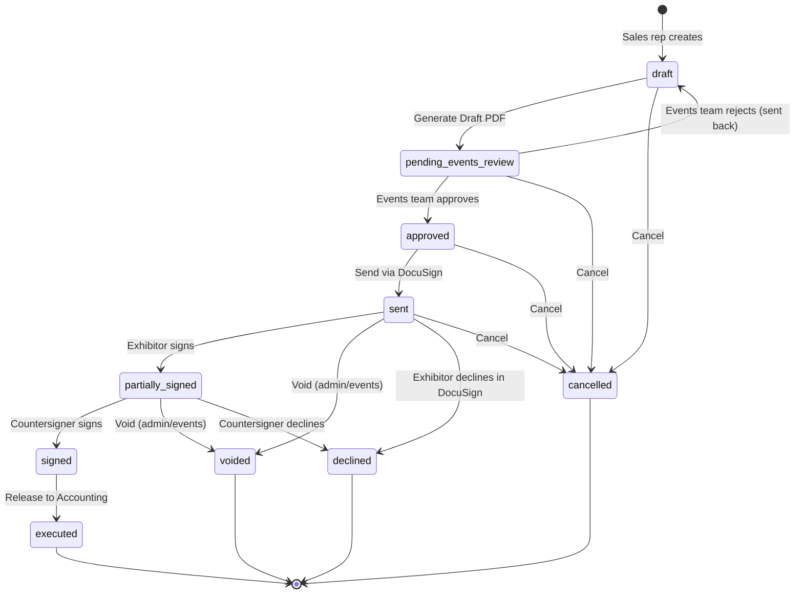
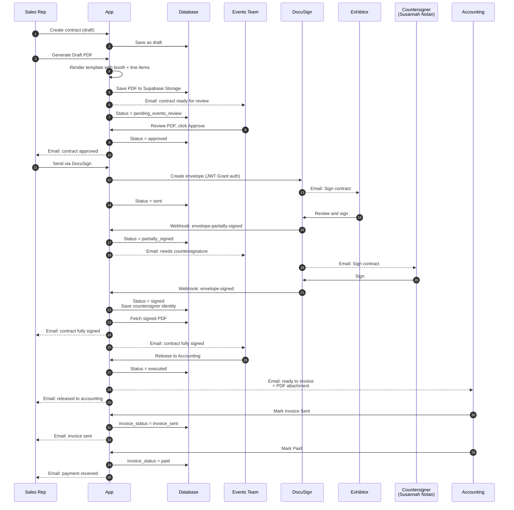
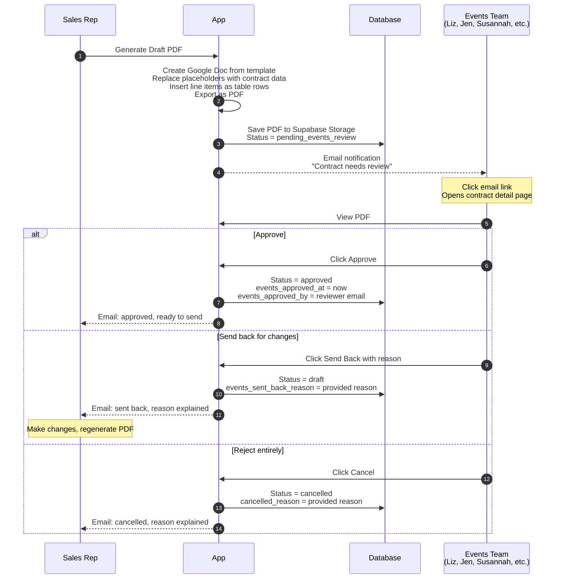
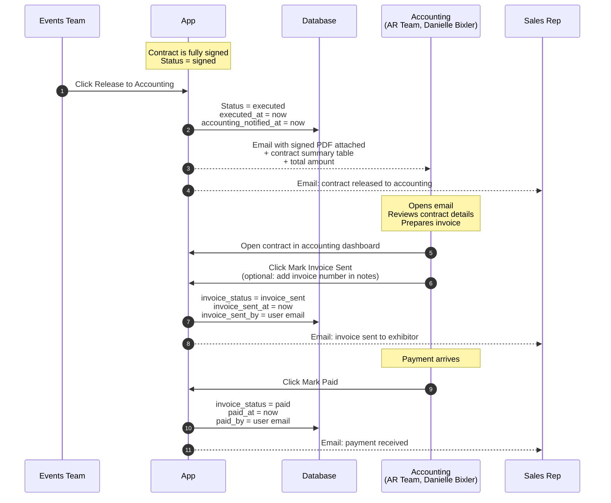
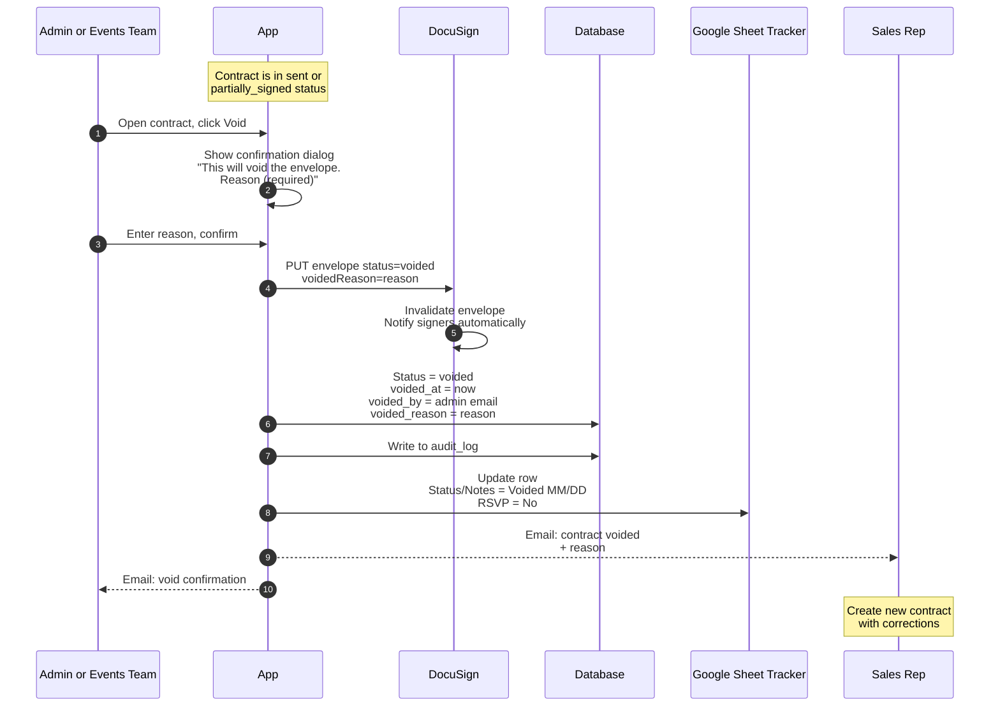
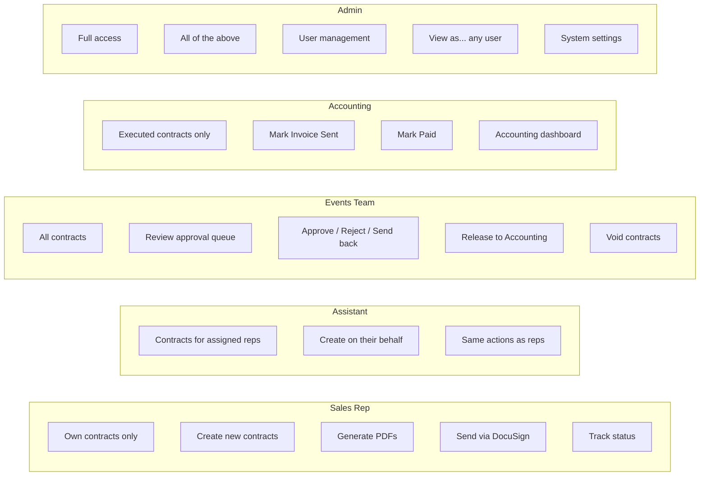
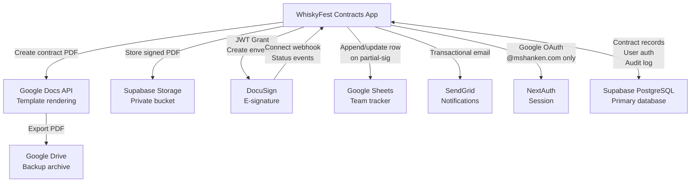

# Contract Workflow — WhiskyFest Contracts

This document describes how a sponsor contract moves through the WhiskyFest Contracts application, from first draft to final payment.

## Overview

A contract follows a defined path through the system. Different roles participate at different stages. The app automates all status transitions and notifications, so each party only takes action when it's their turn.

---

## 1. Contract State Machine

Every contract exists in one of these states. Transitions are controlled by app actions (clicks or webhook events).

### State definitions

| State | Meaning |
|-------|---------|
| **draft** | Contract is being created or edited. No external parties involved. |
| **pending_events_review** | PDF generated. Events team must review and approve before it can be sent. |
| **approved** | Events team has approved. Sales rep can now send via DocuSign. |
| **sent** | DocuSign envelope created. Exhibitor has been emailed to sign. |
| **partially_signed** | Exhibitor has signed. Awaiting M. Shanken countersignature. |
| **signed** | Both parties have signed. Contract is fully executed legally. |
| **executed** | Accounting has been notified. Contract is ready for invoicing. |
| **cancelled** | Contract was cancelled before completion. Not legally binding. |
| **voided** | Contract was voided by admin/events after being sent. DocuSign envelope is invalidated. |
| **declined** | Exhibitor or countersigner explicitly declined in DocuSign. |

---

## 2. Full Signing Sequence

End-to-end flow of a typical contract, from sales rep creation through accounting handoff.

---

## 3. Events Team Approval Workflow

Focused view of the approval stage — what the events team sees and does when a contract lands in their queue.

---

## 4. Accounting Handoff

What happens after a contract is fully signed and moves into the accounting phase.

### Accounting contract states

| Invoice Status | Meaning |
|---------------|---------|
| **pending** | Contract is executed, ready to invoice. Default state when contract moves to executed. |
| **invoice_sent** | Invoice has been sent to the exhibitor. Awaiting payment. |
| **paid** | Payment has been received. Contract is closed from the accounting perspective. |

---

## 5. Void Flow

When an error is discovered after a contract has been sent (but before full execution), an admin or events team member can void it.

### Void availability

Void is ONLY available when:
- Contract status is `sent` OR `partially_signed`
- User has admin or events team role

Void is NOT available when:
- Contract is in draft, pending_events_review, approved → use cancel instead
- Contract is signed or executed → too late, use accounting/cancellation workflow
- Contract is already voided, cancelled, or declined → terminal states

---

## 6. Role-Based Views

What each role sees and can do in the app.

### Permission matrix (summary)

| Action | Sales Rep | Assistant | Events Team | Accounting | Admin |
|--------|-----------|-----------|-------------|------------|-------|
| Create contract | ✓ own | ✓ for their reps | ✓ | ✗ | ✓ |
| Edit contract (draft) | ✓ own | ✓ for their reps | ✓ | ✗ | ✓ |
| Approve contract | ✗ | ✗ | ✓ | ✗ | ✓ |
| Send via DocuSign | ✓ own | ✓ for their reps | ✓ | ✗ | ✓ |
| Release to Accounting | ✗ | ✗ | ✓ | ✗ | ✓ |
| Void contract | ✗ | ✗ | ✓ | ✗ | ✓ |
| Cancel contract | ✗ | ✗ | ✓ | ✗ | ✓ |
| Mark Invoice Sent | ✗ | ✗ | ✗ | ✓ | ✓ |
| Mark Paid | ✗ | ✗ | ✗ | ✓ | ✓ |
| Impersonate users | ✗ | ✗ | ✗ | ✗ | If flagged |
| User management | ✗ | ✗ | ✗ | ✗ | ✓ |

---

## 7. External Integrations at a Glance

How the app interacts with external services during the workflow.

---

## 8. Status Transition Triggers

Quick reference: what causes each status change?

| From | To | Trigger |
|------|-----|--------|
| (none) | draft | Sales rep creates contract |
| draft | pending_events_review | Sales rep generates Draft PDF |
| pending_events_review | approved | Events team clicks Approve |
| pending_events_review | draft | Events team sends back with reason |
| approved | sent | Sales rep clicks Send via DocuSign |
| sent | partially_signed | DocuSign webhook: exhibitor signed |
| partially_signed | signed | DocuSign webhook: countersigner signed |
| signed | executed | Events team clicks Release to Accounting |
| executed | invoice_sent (invoice_status) | Accounting clicks Mark Invoice Sent |
| invoice_sent | paid (invoice_status) | Accounting clicks Mark Paid |
| sent or partially_signed | voided | Admin/events clicks Void + provides reason |
| any active state | cancelled | Admin/events clicks Cancel |

---

## Glossary

**Contract** — A legal agreement between M. Shanken and an exhibitor for WhiskyFest sponsorship.

**Envelope** — DocuSign terminology for a signable document package. One contract = one envelope.

**Events team** — Internal team responsible for reviewing and approving contracts before they go to exhibitors. Also countersigns on behalf of M. Shanken.

**Countersignatory** — The M. Shanken representative who signs after the exhibitor. Currently: Susannah Nolan, Senior Event Director.

**Executed** — A signed contract that has been released to the accounting team for invoicing.

**Paid** — The exhibitor has paid their invoice. Final state for the contract.

**JWT Grant** — DocuSign's service-to-service authentication mechanism using signed JSON Web Tokens.

**Connect Webhook** — DocuSign's system for pushing envelope events (signed, declined, voided, etc.) to the app in real time.

---

*Last updated: [date of last deploy]*
*Contact: Michael Capace — mcapace@mshanken.com*
