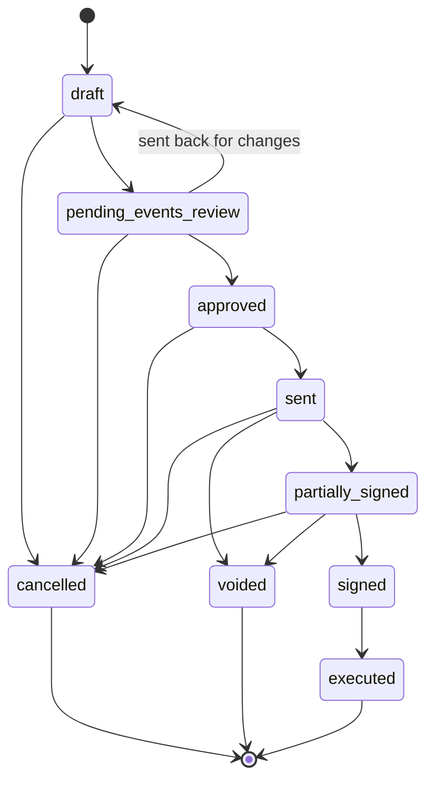
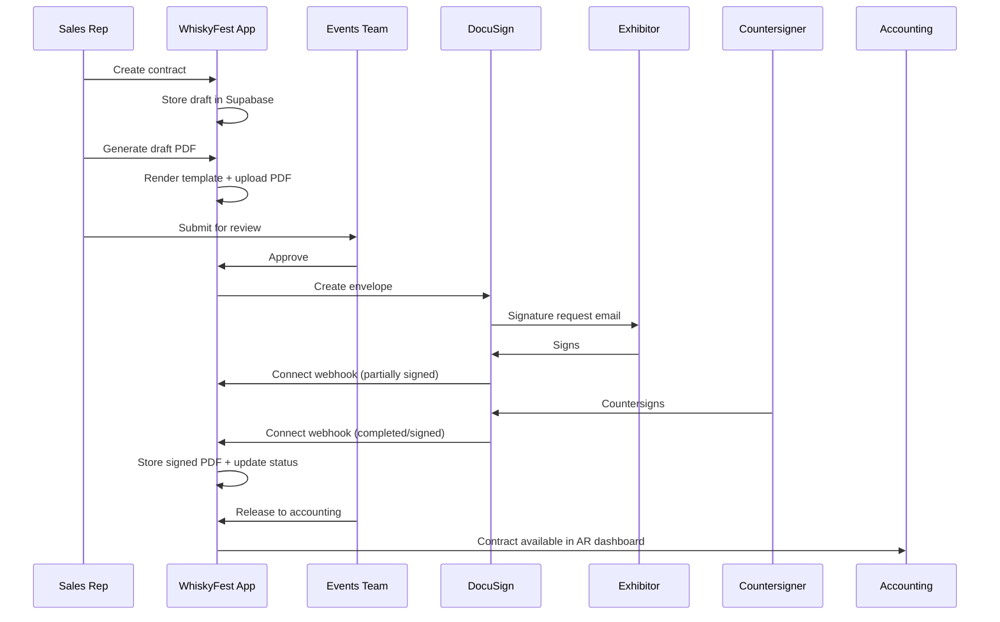
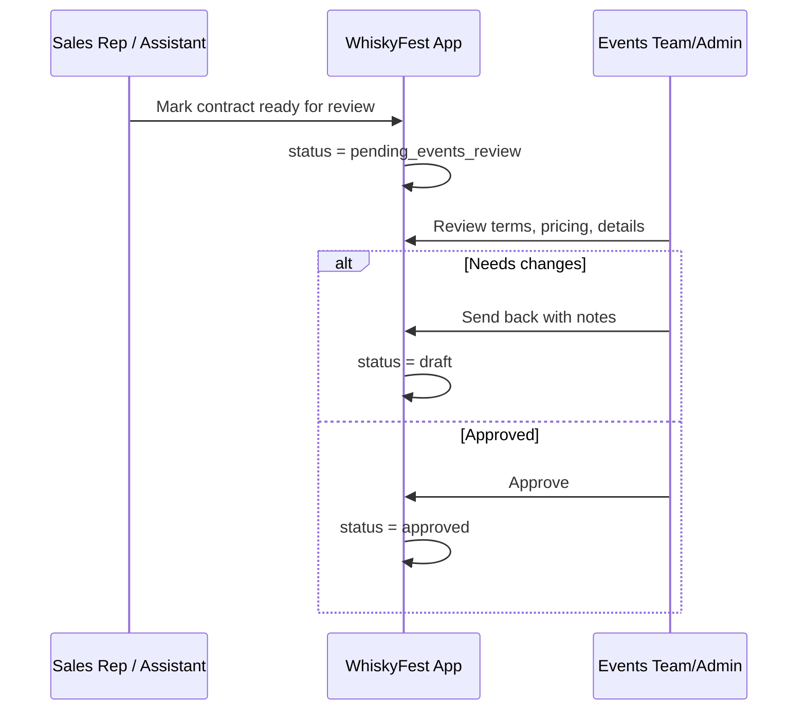
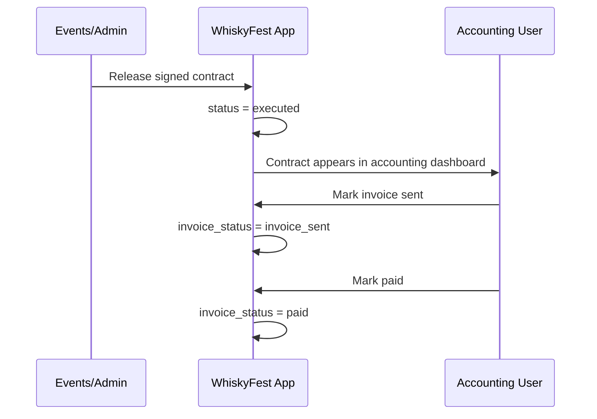
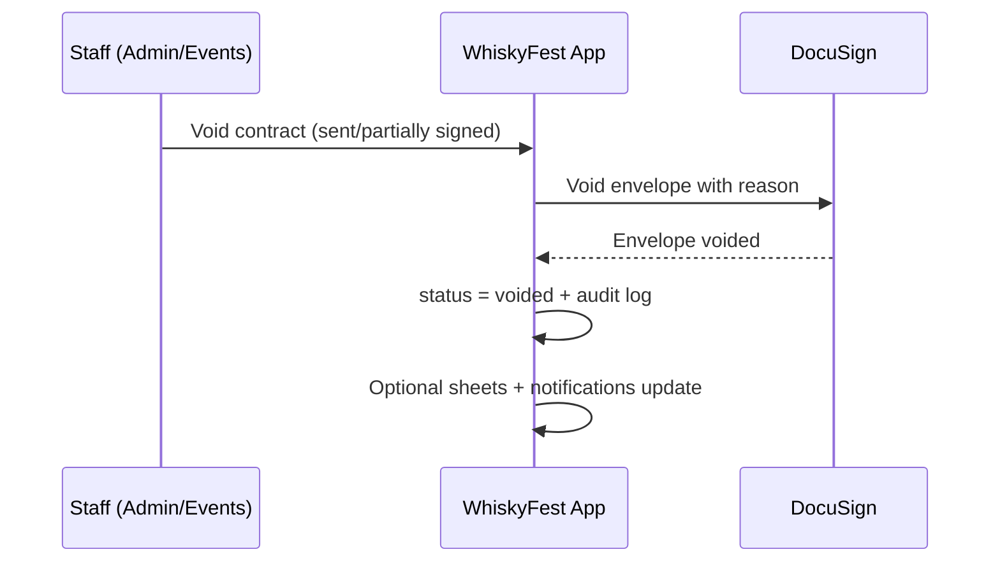

# Workflow

## Contract lifecycle

## Full signing sequence

## Approval workflow

## Accounting handoff

## Void flow

## Role-specific behavior

- **Admin**: full pipeline visibility and action rights, including approval/release/void and user management.
- **Events team**: operational reviewers; can approve/send back/release and void in active signing states.
- **Sales rep**: creates/manages scoped contracts, generates/sends, tracks signer progress.
- **Assistant**: scoped to assigned reps; can monitor and assist with contract prep/send workflow.
- **Accounting**: focuses on executed contracts and invoice lifecycle progression.
